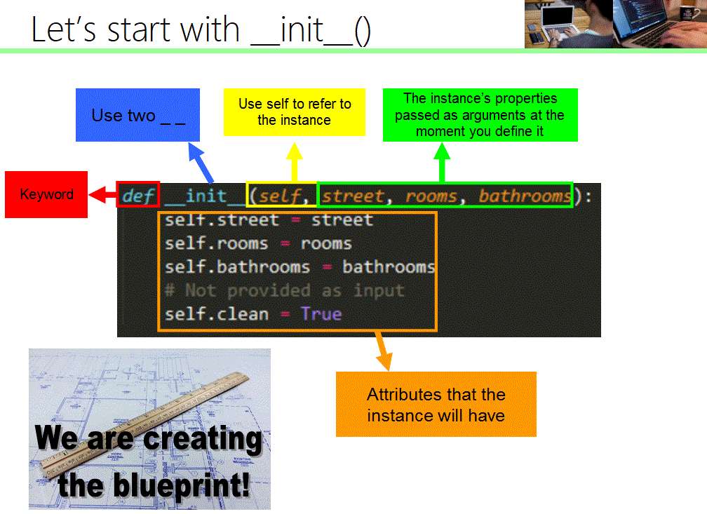

# Python Learning <!-- omit in toc -->

---

## Table of Contents

---

- [Table of Contents](#table-of-contents)
- [`If` Statements](#if-statements)
- [`And`, `Or`, `Not` Statements](#and-or-not-statements)
- [Strings](#strings)
- [`In` operator](#in-operator)
- [Input/Output](#inputoutput)
- [`While` Statements](#while-statements)
- [`For` Loop Statements](#for-loop-statements)
- [`Break` Statement](#break-statement)
- [Modulus division](#modulus-division)
- [`abs()` Function](#abs-function)
- [Bisectional Searching](#bisectional-searching)
- [Call/Invoke a Function](#callinvoke-a-function)
  - [Returning a function](#returning-a-function)
  - [*Some rules for functions*](#some-rules-for-functions)
  - [Scopes inside scopes inside scopes, scopes all the way down](#scopes-inside-scopes-inside-scopes-scopes-all-the-way-down)
- [Inheritance](#inheritance)
- [Recursion](#recursion)
  - [*Some rules*](#some-rules)
- [Modules and Files](#modules-and-files)
  - [File handle](#file-handle)
- [`Tuples`, `List`, `Mutability`, `Cloning`](#tuples-list-mutability-cloning)
  - [`Tuples ()`](#tuples-)
  - [`List []`](#list-)
  - [Operations on Lists](#operations-on-lists)
    - [Convert a List to Strings and back](#convert-a-list-to-strings-and-back)
  - [Other Operations](#other-operations)
  - [Bringing it all together: LOOPS, FUNCTIONS, range, and LISTS](#bringing-it-all-together-loops-functions-range-and-lists)
- [Mutation, Aliasing, Cloning](#mutation-aliasing-cloning)
  - [Mutation and Iteration](#mutation-and-iteration)
- [Functions as Objects](#functions-as-objects)
  - [HOPS Higher Order Procedure](#hops-higher-order-procedure)
    - [Map](#map)
- [Dictionaries](#dictionaries)
  - [List Comprehension and Dictionary Comprehension](#list-comprehension-and-dictionary-comprehension)
    - [List Comprehension](#list-comprehension)
    - [List comprehension with all()](#list-comprehension-with-all)
    - [List comprehension with `set()`](#list-comprehension-with-set)
    - [Dictionary Comprehension](#dictionary-comprehension)
- [Global Variables](#global-variables)
  - [Fibonacci numbers using if statements and recursion versus dictionary and recursion](#fibonacci-numbers-using-if-statements-and-recursion-versus-dictionary-and-recursion)
- [Testing](#testing)
  - [Unit Testing](#unit-testing)
  - [Regression Testing](#regression-testing)
  - [Integration testing](#integration-testing)
  - [Black Box Testing](#black-box-testing)
    - [Summary (Black Box Testing)](#summary-black-box-testing)
  - [Glass Box Testing](#glass-box-testing)
    - [Summary (Glass Box Testing)](#summary-glass-box-testing)
- [Debugging](#debugging)
  - [Error Messages](#error-messages)
  - [Print Statement Debugging](#print-statement-debugging)
  - [Debugging using bisection search](#debugging-using-bisection-search)
- [Debugging: Utilizing Exceptions](#debugging-utilizing-exceptions)
  - [Debugging clauses](#debugging-clauses)
    - [`try` and `except` clause](#try-and-except-clause)
    - [`else` clause](#else-clause)
    - [`finally` clause](#finally-clause)
  - [Assigning Exceptions to Variables](#assigning-exceptions-to-variables)
  - [Capturing Multiple Exceptions](#capturing-multiple-exceptions)
  - [`Finally` Clause](#finally-clause-1)
  - [`With` Statement](#with-statement)
  - [`Raise` Exceptions](#raise-exceptions)
  - [Assertions](#assertions)
- [Object Oriented Programming OOP](#object-oriented-programming-oop)
  - [Advantages of OOP](#advantages-of-oop)
  - [Classes](#classes)
    - [Examples of Classes](#examples-of-classes)
      - [Example #1](#example-1)
      - [Example #2](#example-2)
    - [Key point to classes and OOP](#key-point-to-classes-and-oop)
    - [Class Variables](#class-variables)
      - [Example of Class Variable](#example-of-class-variable)
    - [Class Methods and Static Methods](#class-methods-and-static-methods)
    - [Creating Subclasses](#creating-subclasses)
    - [`isinstance()` and `issubclass`](#isinstance-and-issubclass)
    - [Methods](#methods)
    - [Magic Methods](#magic-methods)
    - [Property Decorators - Getters, Setters and Deleters](#property-decorators---getters-setters-and-deleters)
      - [Getters](#getters)
        - [Example - Getters to perform functions](#example---getters-to-perform-functions)
        - [Example - Creating a Integer Set](#example---creating-a-integer-set)
      - [Setters](#setters)
      - [Deleters](#deleters)
    - [Custom containers](#custom-containers)

This is not an indepth look into each topic but rather just reminders or bits of info to cover my gaps in knowledge

---

## `If` Statements

---

```python
if This line equals true then Continue With this code
elif Else run this code
elif Else run this code
else If nothing before works then proceed to this final code
```

[Back to Top](#table-of-contents)

---

## `And`, `Or`, `Not` Statements

---

```python
and: used for boolean tests where you have two outcomes and determining if they are True or False statements to reach an 'overall' True or False
or: testing between two Truth statements and if EITHER of them are True then the overall test is that atleast one is True
not: testing boolean truth statements where you have an outcome but you wanted the opposite result. not(False) would be True if the statement being tested came out as True.
```

*Precedence* is set as below of which is evaluated first. For example with nested parenthesis and evaluating the *innermost* parenthesis first

```python
not (not (46>25) and (5>6 or 6<3)) and (5<3 or not (3<5))
```

The overall statement returns False

`Precedence in order to evaluate: not>and>or`

[Back to Top](#table-of-contents)

---

## Strings

---

We can make changes to concatination

**Ask for the Length**

```python
len('eric')
#       ask for the length of a string will also count any blank spaces
```

**Ask for a Slice**

***Note***: As with python beginning with index **i** and ends with **j**, the *roof* of this slice is **j** and is not included in the slice i.e s[i:j-1]. So we can say python is ***inclusive exlusive*** as we include the first index element and exclude the last index element

```python
name = 'eric'
name[0]
#       Will print the 0th digit in the variable/string, for example it will produce 'e'
#       In python, the count begins from 0
```

Another example of different ways you can *slice*

```python
s = 'Python is Fun!'
s[1:5]
#       returns: 'ytho'
s[:5]
#       returns: 'Pytho'
s[1:]
#       returns: 'ython is Fun!'
s[:]
#       returns: 'Python is Fun!'
```

You can also *add* a third parameter to your slicing, **k** that represents the **Step Size** that you want to increment by:

```python
s[i:j:k]
#       This gives a slice of the string from index i to index j-1, with a step size k
#       Step size being the size of each iterative jump

s = 'Python is Fun!'
s[1:12:2]
#       returns 'yhni u'
s[1:12:3]
#       returns: 'yoiF'
s[::2]
#       returns: 'Pto sFn'
s[::-1]
#       eturns: '!nuF si nohtyP'
```

[Back to Top](#table-of-contents)

---

## `In` operator

---

The operators **in** and **not in** test for *collection membership*

Say we had a collection 'coll' with a list, or tuple, or dictionary

```python
element in coll
#       tests if 'element' is absent or within the variable 'coll'
#       Evaluations to True or False otherwise

element not in coll
#       Same evaluation to see if element is a member of 'coll' but evaluates to False or True otherwise

equivalant expression to
not (element in coll)
```

[Back to Top](#table-of-contents)

---

## Input/Output

---

With print statements as well as input statements.

**input** expects the value entered by the user to be a string.

We would need to remember that if we want to use it as an integer then we would need to convert after receiving the input.

```python
number = int(input('type something here: '))
print(5 * number)
#       This converts the input provided and casts it into a **integer** type for our purposes or uses later.
```

[Back to Top](#table-of-contents)

---

## `While` Statements

---

if the condition is true, then execute the code and go back to check the condition. Continue to do the condition until that condition is false.

This includes conditions with multiple parameters such as **and**, **or**, **not** etc and other such statements. If it evaluates to True, then it will complete the code and go back up the top.

```python
x = 6
while (x<8):
    print('hello')
    else:
        print('goodbye')
#       it will continue to complete the while loop print function until x is equal or greater then 8. At that point it will no longer be a True statement so it will skip and go to the else statement to complete the False pathway
```

Another example of using a while loop to add numbers together from a starting point and the end being a variable that can easily be changed

```python
end = 6
n = 0
total = 0
while n <= end:
    total += n
    n += 1
print(total)
#       This will produce the combination of adding each value from 1 through to 6 iteratively.
```

Or decreasing in values as you go down from a starting point

```python
number = 10
while number:
    if number > 0:
        print(number)
        number -= 2
```

Squaring a number using variables to hold memory and a while loop to iterate.

The following also shows the process of assigning variables outside of the **while loop** and then amending the variables inside the **while loop**. If we dont make changes to the variables inside the **while loop** then it will continue to grab the default assignments and not evaluate to the conclusion you want

```python
x = 3
answer = 0
iterationsleft = x #        we are assigning the iterations we want to run through as a separate variable so that we can make changes in the loop to this variable without affecting **x**

while (interationsleft != 0):
    answer = answer + x
    iterationsleft = iterationsleft - 1
print (str(x) + '*' + str(x) + ' = ' + str(answer))
```

This code will step into the while loop, check if iterations is **0**. If not, then it will run the code until iterations is *equal to 0*. Meanwhile the variable **answer** is changed as we repeat the loop each time and **iterationsleft** is reduced for each repeated loop. This way our **x** variable remains unchanged and as **answer** gets adjusted by adding in **x** again, this way we are adding **x** to itself for **x** amount of times: Thereby ***squaring*** the number.

[Back to Top](#table-of-contents)

---

## `For` Loop Statements

---

```python
for n in range(5)
#       range will give us back the integers 0 though to and up till 5 but not including 5.
```

You can also use *slices* and *indices* within the for loop

```python
for n in range(5:11:2)
#       will complete the range starting at 5 and increment by 2 until we reach 11 but not including 11.
```

Similarly you can use the For loop in the following manner:

```python
for i in range(0,10,2):
    print(i)
#       which will print 0, 2, 4, 6, 8 but not 10

for i in range(10,0,-2):
    print(i)
#       prints 10, 8, 6, 4, 2 but not 0
```

If you are given some variable that you need to combine or use and the variable is scalable and without your code breaking and you want to include the end-value **somenumber**

```python
somenumber = 10
total = 0
for i in range(1,somenumber+1):
    total += i
print(total)
#       this will run through the numbers and add each number to the **total** and this will also be inclusive of the end index **somenumber**
```

[Back to Top](#table-of-contents)

---

## `Break` Statement

---

Using a statement to break out of some code at a certain point
For example, if I evaluate something as **True** and no longer want to continue the code, **Break** provides a natural way to get out of the loop

```python
mysum = 0
for i in range(5:11:2):
    mysum += i
    if mysum == 5:
        break

print(mysum)
#       This code says, if mysum == 5 then we want to stop the loop. As this range starts with the number 5, mysum is increased by i(5) and then the if statement evaluates to True; so we break
```

[Back to Top](#table-of-contents)

---

## Modulus division

---

Modulus division is an easy way to test for even or odd numbers.
The mod sign % used in a test has the following general english explanation:

```python
0 % 2
#       The number 2 (on the right) goes into the number 0 (on the left) exactly 0 times (x amount of times). Afterwards there is 0 remaining.
2 % 2
#       2 goes into the number 2 exactly one time and there is 0 remaining.
3 % 2
#       2 goes into the number 3 exactly one time and there is 1 remaining.
23 % 5
#       5 goes into the number 23 example four times and there is 3 remaining.
```

Using this technique you can test for even numbers by using **mod** division and it will determine if the number is able to be evenly split, thereby being **even**.

[Back to Top](#table-of-contents)

---

## `abs()` Function

---

Syntax follows the `abs(number)` format.

- Used to return the absolute value of a number
- It can be integer, a floating point number or complex number

```python
float = -54.22
print('absolute value of this float is: ', abs(float))
#       prints 54.22
integer = -88
print('absolute value of this intege is: ', abs(integer))
#       prints 88
complex = 3-4j
print('absolute value or magnitude of complex is: ', abs(complex))
#       prints 5.0
```

[Back to Top](#table-of-contents)

---

## Bisectional Searching

---

if you are trying to find a specific number and you know the beginning and end parameters then bisectional search is a great way to efficiently and effectively reach the outcome. Each step you are halving the available data and then you continue to repeat the step until you have found your answer.

This is really powerful as the computation time is dramatically reduced by halving and throwing away the data we dont need

```python
x = 25
epsilon = 0.01
numGuesses = 0
low = 1.0
high = x
#       high is initialised as our guess x = 25
ans = (high + low)/2.0

while abs(ans**2 - x) >= epsilon:
    print('low = ' + str(low) + ' High = ' + str(high) + ' ans = ' + str(ans))
    numGuesses += 1
    if ans**2 < x:
        low = ans
    else:
        high = ans
    ans = (high + low)/2.0
print('numGuesses = ' + str(numGuesses))
print(str(ans) + ' is close to a square root of ' + str(x))
```

[Back to Top](#table-of-contents)

---

## Call/Invoke a Function

---

Functions take a set of parameters; the number can be 0 and the parameters are set inside the function.

```python
def is_even (i):        #keyword || name || parameters or arguments
    """
    Input: i, a positive int
    Returns True if i is even, otherwise false
    """
    print('hi')
    return i % 2 == 0

is_even(3)          # calling the function using its name and values for parameters.

        # as per the function if we assign i = 3 as per the call, then we replace all i's with 3.
```

[Back to Top](#table-of-contents)

---

### Returning a function

---

Instead of invoking and calling a function. You can have another function *return* a function.  
You can imagine it follows as such: when *returning* a function by **not** providing parameters at all (parenthesis), then we are not asking for **that function we are returning** to return any *result*.  
Instead the function call will return a function and this new function returned is going to take the place of the entire intial function call

```python
def add (x,y):
    return x + y
def times(x,y):
    return x*y
def add_or_times (a):
    if a > 5:
        return add #        returning a function but not calling on the function with parameters
    else:
        return times
#       for example:
add_or_times(6)(3,1)
#       great than 5
#       return add
add(3,1)
>>>4
#       so we can see we replaced our initial function with the returned function but then we ran the parameters using that new function
```

[Back to Top](#table-of-contents)

---

### *Some rules for functions*

---

- Only one **return** will be completed as the **return** order throws you outside of the function.
- Any code inside of the function but **after** the **return** statement will be ignored.
- If you dont have an explicit return given inside the function, then it will return the value **None**
- Value is given to the function caller, so functions have a value associated with it

[Back to Top](#table-of-contents)

---

### Scopes inside scopes inside scopes, scopes all the way down

---

Sometimes called an internal or helper function. It only belongs inside and to the function that we called. It's protected.

```python
def scope_one():
    def scope_two():
        print('a')

    x = 3
    y = 'and so forth'
```

[Back to Top](#table-of-contents)

---

## Inheritance

---

Taking on the variables and set parameters from previous (higher) scopes that sit in a hierachy. As we progress down the rabbit hole with new scopes, the inheritance of the previous scopes follow through.

```python
def g(x):
    def h():
        x = 'abc'
        #       note there is no return statement so this variable is not returned to x
    x = x + 1
    print('in g(x): x =', x)
    h() #       calling that h() function now and creating that new scope
    return x

x = 3
z = g(x)
```

[Back to Top](#table-of-contents)

---

## Recursion

---

Design solutions to problems by breaking it up into pieces that you can use.

[Back to Top](#table-of-contents)

---

### *Some rules*

---

- Each recursive call to a function creates its own scope/environment
- Bindings of variables in a scope is not changed by recursive call
- flow of controll passes back to previous scope once function call returns value
- Figure out what *Base Case* to use - i.e what is the bottom line.
- Within recursion you won't have conditions to meet that will break you out of the loop. Therefore its important to make sure that you are **changing** the parameter so that you meet the base case. i.e you are running each successive recursion, with a smaller version of the parameter. Eventually hitting a floor, and your **test case**.

```python
def mult(a,b):
    if b == 1:
        return a
    else:
        return a + mult(a,b-1)
```

We can also recursively solve characters or strings instead of only numbers. For example solving for a **palindrom** whereby the string reads left the same as it reads right (backwards).

```python
#       step 1 write function to convert string into useable characters
#       step 2 recursive solution for checking first  and last
#       step 3 call on palindrom function then call function for converting string.
#       bundle this up into a single function or template is_palindrome (s)

def is_palindrome (s):
    def to_chars(s):
        s = s.lower()
        ans = ''
        for c in s:
            if c in 'abcdefghijklmnopqrstuvwxyz':
                ans = ans + c
                #       purpose here is to convert a string or sentence into just its character form, thereby removing any spaces, special characters and numbers and converting it all the lower case.
        return ans

    def is_pal(s):
        if len(s) <= 1:
            return True
        else:
            return s[0] == s[-1] and is_pal(s[1:-1])
            #       purpose here is to test if the first letter and the last letter are equal and then to call on the function again recursively doing so on the remaining letters until we get a length of 1 or 0 letters (which is 100% a palindrome.

    return is_pal(to_chars(s)) #        calling on the is_pal recursion and instead of doing it directly on the string; we call it on our function that converts the string into something useable.

print(is_palindrome('are weew era'))
```

[Back to Top](#table-of-contents)

---

## Modules and Files

---

Modules is a .py file containing a collection of Python definitions and statements.

You can import these .py files into the shell or into some other file if we want to use it there.

Invoking the module:

Inside some filename.py, we can define the variable pi = 3.14159 and have the definitions inside there be consistent with the variable we have there.

In another file, we can import this file to use the definitions and code there within.

```python
import filename
pi = 3
print(pi)
>>>3
print(filename.pi)
>>>3.14159
print(filename.some_definition(3)))
>>>will do the calculation based on using filename and applying it to the number we passed it
```

With the above code it means if we want to use the definitions or code from the file, we would need to append or use the **filename.*whatever*** in order to use the code inside the filename.

Another option if we don't want to refer to variables by their module i.e **filename.*area*** or **filename.*variable_name***; we can use the:

```python
from filename import *
```

This has the effect of creating bindings within our current shell or scope for all objects defined inside **filename**

[Back to Top](#table-of-contents)

---

### File handle

---

handling of files or many files.py is important if you are going to sync across them or have different features/products inside each file but you want to draw of each other.

With the internal file handling, it doesn't require the operating system and can be done through various functions and options such as below

```python
name_handle = open('kids', 'w')


#       open is going to open up a file - access into a file.
#       the 'w' is for writing *directly* into it.

name_handle.close()
#       The closed parenthesis shows we are *invoking* the close of the file.
#       When done I can close the file. shut up shop
```

There are some additional modularity such as **r** for only reading the file and as such can print lines or details from a file.

[Back to Top](#table-of-contents)

---

## `Tuples`, `List`, `Mutability`, `Cloning`

---

### `Tuples ()`

---
Tuple is an ordered sequence of elements. They are **immutable**; they cannot be change inside the Tuple.

Tuples require the extra comma to indicate they are tuples if it is **just one** element. For example having just one tuple `t = ('one',)`: this will produce `('one',)`. **More than one** element does not require the comma

```python
Tuples make use of *parenthesis* () for values inside tuples
```

We cannot change the inner pieces of a Tuple, similar to how strings are immutable. We can add to it, we can splice it, but we cannot change the values.
Tuples are also **Iterable** so it means you can walk down the tuple and use each value how you would like.

```python
for Tuples with only **1** element then you will make use of the comma in order to form a correct Tuple.
x = (1,) = Tuple
x = (1) = Int
#       However if the Tuple has multiple elements then you dont need to use the comma at the end to form a Tuple
x = (1, 2, 3) = Tuple
```

[Back to Top](#table-of-contents)

---

### `List []`

---

Big difference between **Tuples** and **Lists** is that the **Lists** are mutable; they can be changed.

Lists containts elements, normally all of 1 type such as *all integers* or rarely mixed elements.

They are also accessible by index, so you can do all the usual tests

- len(List) # Get a length
- List[0] # Find the index
- List[2] + 1 # Find the index and do something to it
- List[3] # Go outside the list range and get errors

The important distinction is that a List is mutable so we can perform the following

- List[1] == 5 # changing index 1 to the integer 5

[Back to Top](#table-of-contents)

---

### Operations on Lists

---

Certain operations we can do with lists. As with lists, they are mutable so once you use operations on lists, it will change that variable or that list permanently.

- The dot tells python to *get out some **method***

```python
List.append(n) #            we can append or add another element to the list.
List.extend[0,2] #          Take a list and add to the end of it. Does not return anything until you call on the list
del(List[1]) #              to remove the element at index 1.
pop(List)#                  Remove from the **end** of the list and returns the removed element
List.remove(element) #      a specific element by looking for the element and removes it, if multiple occurances then it will remove the first. If element not in the list then it will give an error.
ListAB = ListA + ListB #    We can concatenate two lists ListOne + ListTwo
```

[Back to Top](#table-of-contents)

---

#### Convert a List to Strings and back

---

```python
list(s) #               returns a list with every character from s an element in the list\
s.split() #             Split the string on a character
s.split('<') #          Split at this character
''.join(list) #         Will join all the characters i nthe list to produce a string
'_'.join(list) #        will do the same but place the special character '_' between each element of the list.
```

[Back to Top](#table-of-contents)

---

### Other Operations

---

sorted() does not mutate the list while the **method** sort() mutates the list

```python
sorted(List) #                      returns a sorted version of List. Provides a sorted version of List but does not mutate it
List.sort() #                       empty parenthesis to say invoke the function And this will mutate the List to be ordered
List.reverse() #                    empty parenthesis to invoke the call. and this will mutate the list.
List.insert(index, element) #       inserting an element at the nth index. Returns none as it doesnt return anything
List.count(element) #               counts number of occurences. returns number
```

[Back to Top](#table-of-contents)

---

### Bringing it all together: LOOPS, FUNCTIONS, range, and LISTS

---

range is a special procedure and actually returns something that behaves like a **Tuple**

For example  range(5) would bring a ***List*** [0, 1, 2, 3, 4].

So this means you can think of it like a list similar to how you would slice or call on it. i.e range(5, 2, -1) using the step and going backwards and such.

[Back to Top](#table-of-contents)

---

## Mutation, Aliasing, Cloning

---

We need to be careful with variables with lists that we assign: assigning them to directly to each others list means if its mutated, it will affect both variables.

```python
variable = ['sunny', 'windy', 'rainy']
weather = variable
#       This points to the same list in the internal computer memory we have allocated. So if we change the list, it affects both variables and this may have unexpected consequences
```

Making a clone of this variable is easier in order to set up separate lists inside the memory allocation

```python
variable = ['sunny', 'windy', 'rainy']
weather = variable[:]
#       this difference is that we are cloning and greater a second list for the variable *weather* so that each variable points to its own list.
```

Cloning is useful when I want to do something to a list that involves mutation but doesnt affect the original list.

[Back to Top](#table-of-contents)

---

### Mutation and Iteration

---

When iterating over a list, python will adjust and mutate the list as it proceeds with each variable. So if you give it instructions to remove a value at nth index. Then python may not behave like you think because as it removes an *element*; the list becomes smaller -1 on the next iteration and the next step that was supposed to be at index [2], the element [3] has now moved down to [2] and the original [2] has moved down to [1] thereby the code **skipping** 1 element.  

Cloning lists is the best way to iterate correctly and keep python on track with each iteration

```python
def removeDuplicate(List1, List2):
    List1_Copy = List1[:] #         create a clone of List1
    for e in List1_Copy:
        if e in List2:
            List1.remove(e) #       Thereby iterate over each element in Copy, if the value is in List 2, then we remove it from List 1 and mutate the original: remove the duplicates
```

[Back to Top](#table-of-contents)

---

## Functions as Objects

---

Functions are **first class objects** in saying that they :

- Have types
- can be elements of data structures like lists
- can appear in expressions (as part of an assignment statement and as an argument to a function)

Functions are particularly usefules as arguments when coupled with lists known as **higher order programming**

```python
def applyToEach(List,Function):
    for i in range(len(List)):
        L[i] = function(List[i]) #      for each index I get out of the list, apply the function to it; then put it back into the list and replace that original [i]
#       This will cycle through the list and at each index, apply the function and return it back to the list.
#       The list is amended and replaced with the function-applied index.
List = [1, -2, 3.4]
applyToEach(List,abs)
#       returns [1, 2, 3.4]
applyToEach(List,int)
#       return [1, 2, 3]
applyToEach (List, fact) #      factorial function that we defined earlier on
#       returns [1, 2, 6]
applyToEach(List, fib) #        fibonacci function that we defined earlier on
#       returns [1, 2, 13]
```

In the reverse as well

```python
def applyFunctions(List, x):
    for function in List:
        print(function(x))

applyFunctions([abs int, fact, fib], 4) #       we provide a list of functions that we can to invoke in place of *List* and then apply those functions to the number 4 that we pass in
#       returns
#       4
#       4
#       24
#       5
```

[Back to Top](#table-of-contents)

---

### HOPS Higher Order Procedure

---

#### Map

---

```python
map(abs, [1, -2, 3, -4])
#       map will walk down the list provided in the argument and apply the function to each element. and allow us to print the outcome
for elt in map(abs, [1, -2, 3, -4]):
    print(elt)

#       returns [1, 2, 3, 4]
```

There is a difference here between what we did before; applying the functions to the index elements that we pull out and then we put the mutated elements back to that list

That list always pointed to the same list in the memory so we are mutating that list with each iteration.

By contrast, map gives me back a structure that acts like a list that I have to walk back out to get what I want; printing it out or using it.

**map** can also be used to run down more than 1 list, apply a function to each item in each list and produce an outcome taking the **whole** data in to account

```python
list1 = [1, 28, 54]
list2 = [2, 34, 17]
for elt in map(min, list1, list2):
    print(elt)
#       Returns the minimum of each index compared. so Index [0] for each list, the minimum is 1. For index [1] for each list, the minimum is 28 and for index [2] for each list, the minimum is 17
#       returns [1, 28, 17]
```

[Back to Top](#table-of-contents)

---

## Dictionaries

---

With lists, you operate on a index starting at 0, and you have a element assigned to that index. as you walk through the list, the index and the element correspond to the place it is currently in the list

With **dictionaries**, we have what is referred as ***keys*** and instead of asking for a zeroth element or ith element; we are going to say, *"give me the element associated with this key"*.

I can look up a **key** and retrieve all information associated with that **key**

```python
my_dictionary = {}
#       creating empty dictionary
grades = {'Ana':'B', 'John':'A+', 'Casey':'C-'}
grades['John']
#       Will return 'A+'
grades ['Sylvan'] = 'A'
#       Will add a new entry into that dictionary
'John' in grades
#       will return True or False if the key is in the dictionary
del[grades['Ana']]
#       Deletes an entry
grades.keys() #because its a method, open&close parenthesis calls the method
#       Returns an iterable of all keys, I can walk down all the collection of values and do something to them
grades.values()
#       Returns an iterable of all values, I can walk down all the collection of values and do something to them
```

- Values = They can be anything, lists or even other dictionaries
- Keys = Must be unique, Immutable type (int, float, string, tuple, bool)
- Careful with using float type because if the float has a rounding or accuracy issue then we may no find the key associated with it
- Dictionaries has no order guaranteed. Your **keys** are your calling cards and should not be thought of in terms of using indices to call positional elements.

[Back to Top](#table-of-contents)

---

### List Comprehension and Dictionary Comprehension

---

List comprehension and by extention dictionary comprehension is a great way of making readable, compact way of creating lists or dictionaries. Merging several lines into a single line that indicates which elements should be added to the list.

[Back to Top](#table-of-contents)

---

#### List Comprehension

---

```python
list = []
for i in range(15):
    if i % 2 == 0:
        list.append(i)
```

and then using **list comprehension**

```python

list = [i for i in range(15) if i % 2 == 0]
#       syntax being [value we return to list] for [element] in [sequence] if [condition]
#       so we iterate every each value from 0 to 14 but not including 15 and if the [condition] is met, the integer meets the criteria, then include the [value we return to the list] in the final list
```

For the above code:

- the **condition** is optional as we can simply *i for i in range(15)* and return all integers into a list.
- Not restricted to just integers, we can also have expressions to alter the [i] indices

```python
list = [i*3 for i in range(15) if i%2 == 0]
#       iterates over 0 - 14 and selects all *even* but we mutate the index value at each iteration.
#       if called, returns [0, 6, 12, 18, 24, 30, 36, 42]

list = [value for value in namesDict.values() if value % 2 != 0]
#       depending on what is in the dictionary, we can iterate over each **value** in the dictionary and use the values to test the if [condition] then select those and assign them to the *list*

#       another example
secretWord = 'durian'
lettersGuessed = ['h', 'a', 'c', 'd', 'i', 'm', 'n', 'r', 't', 'u']

    return len(("".join(char for char in lettersGuessed if char in secretWord))) == len(secretWord)

```

[Back to Top](#table-of-contents)

---

#### List comprehension with all()

---

The all() method returns True boolean if all elements within an iterable is True otherwise it returns False

Syntax `all (iterable)`

```python
secretWord = 'durian'
lettersGuessed = ['h', 'a', 'c', 'd', 'i', 'm', 'n', 'r', 't', 'u']

    all(c in lettersGuessed for c in secretWord)
    #       single liner using list comprehension rules to produce a boolean returned.
    >>> True
```

[Back to Top](#table-of-contents)

---

#### List comprehension with `set()`

---

Basic uses of set() includes membership testing and eliminating duplicate entries

curly braces or the set() function can be used to creat sets.
Note: to create an empty set, you have to use set(). Curly braces will only create an empty dictionary

```python
secretWord = 'durian'
lettersGuessed = ['h', 'a', 'c', 'd', 'i', 'm', 'n', 'r', 't', 'u']

set(lettersGuessed) >= set(secretWord)
#       or
set(c for c in lettersGuessed if c in secretWord)
#       returns {'a', 'd', 'i', 'n', 'r', 'u'} just need to compare the set to secretWord
```

[Back to Top](#table-of-contents)

---

#### Dictionary Comprehension

---

Python allows you to create new dictionaries from existing ones but assigning **different** ***values***

```python
dictionary = {key:new_vlaue for (key, value) in dictionary.items()}
#       iterates over the keys and values in a dictionary and adds the corresponding key and new value that is the result of an expression
```

For example for the following dictionary:

```python
grades = {"Nora": 90, "Lulu": 15, "Gino": 60}
doubleGrades = {key: value*2 for (key, value) in grades.items()}
doubleGrades
#       returns {'Nora': 180, 'Lulu': 30, 'Gino': 120}
```

You can also use **conditions** in dictionary comprehension

```python
grades = {"Nora": 90, "Lulu": 15, "Gino": 60}
doubleGrades = {key: value*2 for (key, value) in grades.items() if value % 2 == 0}
#       selects only *even* if the **original** value was even
doubleGrades
#       returns {'Nora': 180, 'Gino': 120}
```

[Back to Top](#table-of-contents)

---

## Global Variables

---

Convenient when we want to keep track of information inside of a function

Dangerous because:

- Breaks the scoping of variables by function call
- side effects unseen in your code by affecting the global scope

**global** can be used by making the function or variables accessible **outside** of your define functions.

[Back to Top](#table-of-contents)

---

### Fibonacci numbers using if statements and recursion versus dictionary and recursion

---

```python
numFibCalls = 0 #       initialise our counter
def fib(n):
    global numFibCalls
    numFibCalls += 1
    if n == 0 or n == 1:
        return n
    #       both base cases checked!
    else:
        return fib(n-1) + fib(n-2)

print(fib(12))
print('Number of times the function is called: ', numFibCalls)

#       144
#       Number of times the function is called:  465
```

and dictionary

```python
numFibCalls = 0
def fibefficient(n, d):
    global numFibCalls
    numFibCalls += 1
    if n in d:
        return d[n]
    else:
        ans = fibefficient(n-1, d) + fibefficient(n-2, d)
        d[n] = ans
        return ans

d = {0:0, 1:1}
print(fibefficient(12,d))
print('Number of times the function is called: ', numFibCalls)

#       144
#       Number of times the function is called:  23
```

[Back to Top](#table-of-contents)

---

## Testing

---

Design code that can easily test and debugged by breaking up the code into simplified modules that allows you to test each module to the design of how you wanted it to function.

[Back to Top](#table-of-contents)

---

### Unit Testing

---

- Take each piece of program and validate it
- testing each function separately

[Back to Top](#table-of-contents)

---

### Regression Testing

---

- Add test for bugs as you find them in a function
- Catch reintroduced errors that were previously fixed

[Back to Top](#table-of-contents)

---

### Integration testing

---

- Does overall program work?

[Back to Top](#table-of-contents)

---

### Black Box Testing

---

Testing by going through the specifications to realise any potential bugs. This method is designed to be done without looking at the code

[Back to Top](#table-of-contents)

---

#### Summary (Black Box Testing)

---

- designed without looking at the code
- Just look at the specifications
- Explore paths through specifications
  - Empty list, list of 1 and list of many and so on
  - What if I have any extreme cases of really large numbers, or really small numbers
  - Testing floats and negatives if the specifications shows its designed for it

[Back to Top](#table-of-contents)

---

### Glass Box Testing

---

Testing by going through the **code** and following the available paths to reach potential bugs. This method is designed to just complete the grunt work.

For example:

```python
def abs(x):
    """ Assumes x is an int
    returns x if x>=0 and -x otherwise"""
    if x < -1:
        return -x
    else:
        return x
```

The above code shows that path-complete tests could *miss a bug*, using path-complete testing such as **abs(2)** or **abs(-2)** would test each path however if you failed to complete boundary case testing then you would miss that **abs(-1)** incorrectly returns **-1**

[Back to Top](#table-of-contents)

---

#### Summary (Glass Box Testing)

---

- Designed with looking at the code
- Use code directly to guide design of test cases
- **path-complete** if every potential path through code is tested at least once
- ***Drawbacks include:***
  - can go through loops arbitrarily many times
  - missing paths
- ***Guidelines***
  - **branches** - exercise all parts of a conditional
  - **for loops** - loop not entered; body of loop executed exactly once; body of loop executed more than once
  - **while loops** - same as **for loops**, cases that catch all ways to exit loop

[Back to Top](#table-of-contents)

---

## Debugging

---

### Error Messages

---

- **IndexError**
  - trying to access beyond the limits of a list
  - `test = [1,2,3]`
  - `test[4]`
- **TypeError**
  - trying to convert an inappropriate type
  - `int(test)`
- **NameError**
  - referencing a non-existing variable
  - `a`
- **TypeError**
  - Mixing data types without appropriate coercion
  - `'3'/4`
- **SyntaxError**
  - forgetting to close parenthesis, quotation etc
  - `a = len([1, 2, 3, 4]`
  - `print a`
- **AttributeError**
  - Attribute reference fails (i.e in classes)
- **ValueError**
  - operand type okay but value is illegal
- **IOError**
  - IO systme reports malfunction (i.e file not found)

[Back to Top](#table-of-contents)

---

### Print Statement Debugging

---

Print statements are great for debugging, use the following steps to break it down:

- Print when you enter a function
- Print out the values of the parameter - Make sure they are what you expect.
- Print Result to check if its expected
- Bisection method used to debugging - Place the print statement in the middle of the code\
and work through and see if the bug is higher or lower

[Back to Top](#table-of-contents)

---

### Debugging using bisection search

---

Using bisection search in order to find bugs within the code. Placing print statemenths halfway through and see which side of the code the error is occuring.

Repeating this step would lead eventually to a much smaller segment of the code and we can debug in that smaller segment allowing us to narrow down the issue.

- Look for the usual suspects such as aliasing etc
- Eliminate segments or locations so that you can isolate the bug
- Don't believe the documentation

[Back to Top](#table-of-contents)

---

## Debugging: Utilizing Exceptions

---

The important thing for handling exceptions is that **_your program doesn't crash_**. Instead of the program finishing at the error, this actually handles the error and proceeds with the rest of your code.

This could be exceptions for your own code running into issues or when you are calling on user input and it is **not within the parameters** of your code to execute **i.e expecting a integer but user enters a string.**

***Example 1***

```python
try:
    age = int(input("Age: "))
except ValueError:
    print("You have not put a valid number for your age")
```

This try clause will place the variable assignment and the user input inside a try clause to single out the potential bug. If the user enters a **integer** then proceed as normal. If a **string** then it will encounter the ValueError.

***Example 2***

```python
try:
    a = int(input("Tell me one number:"))
    b = int(input("tell me another number:"))
    print(a/b)
    print("okay")
except:
    print("bug in user input")
print("Outside")
```

***Example: Controlling Input***

```python
while True:
    try:
        n = input("Please enter an integer")
        n = int(n)
        break
    except ValueError:
        print("Input not an integer; try again")
print("Correct input of an integer!")
```

[Back to Top](#table-of-contents)

---

### Debugging clauses

---


[Back to Top](#table-of-contents)

---

#### `try` and `except` clause

---

`try:`  
`except:`

Special keywords: with this block of code **"try"** this block of code.If the **try** block of code runs well then the code continues

If an exception is raised then it will stop what it is doing and jump to the **except** clause and execute those instructions but *then carry on outside that loop*.

[Back to Top](#table-of-contents)

---

#### `else` clause

---

Body of this is executed when execution of the try body **completes with no exceptions**

***Example 3***

```python
try:
    age = int(input("Age: "))
except ValueError:
    print("You have not put a valid number for your age")
else:
    print("No exceptions were thrown")
print("The program continues to run")

```

The above code states: if there is no exceptions then run the following code and then proceed as normal.

**With no exception raised**:  it will print "*No exceptions were thrown"* and then prints *"The program continues to run:"*\
**With ValueError exception raised**: it will print *"You have not put a valid number for your age"* and then prints "*the program continues to run"*

[Back to Top](#table-of-contents)

---

#### `finally` clause

---

Body of this clause is always executed after `try`, `else` and `except` clauses even if they raised another erro or executed a `break`, `continue` or `return`

- Useful for clean-up code that should be run **no matter what else happened** (i.e close a file so you don't leave it hanging open)

[Back to Top](#table-of-contents)

---

### Assigning Exceptions to Variables

---

Furthermore you are able to raise errors and assign the errors to variables

```python
try:
except ValueError as ex:
    age = int(input("Age: "))
    print("You have not put a valid number for your age")
    print(ex) #         this will print the variable which has been assigned some memory of the ValueError produced
    print(type(ex)) #       This will print the type of the exception that was thrown
else:
    print("No exceptions were thrown")
print("The program continues to run")

```

Repetitive code is bad practice because it may mean that if future changes need to be made, then you need to edit
multiple lines in order to correct it all whereas if you aren't repeating your code, then the error or change just
needs to occur to 1 piece of code.

The following is used if you want to capture more than 1 exception that is thrown and you want to use the same
exception error message. Furthermore in the instance it captures a ZeroDivisionError.

It is important to note that if you had or have another `except` clause that was looking for ZeroDivisionError as well
such as `except ZeroDivisionError: print("You have not put a valid number for your age")` then the code won't print
out twice. It will only jump to the first except clause that the error hits then proceed to ignore the rest of the
except clauses.

[Back to Top](#table-of-contents)

---

### Capturing Multiple Exceptions

---

```python
try:
    age = int(input("Age: "))
    xfactor = 10 / age #        what if age is 0? This would no longer produce a ValueError
except (ValueError, ZeroDivisionError): #       errors added in parenthesis and separated by comma
    print("You have not put a valid number for your age")
else:
    print("No exceptions were thrown")
print("The program continues to run")
```

The `finally` clause is always executed whether you have an exception or not. This is used to usually release resources
such as closing files, data os connections, network connections and so on.

[Back to Top](#table-of-contents)

---

### `Finally` Clause

---

```python
try:
    file = open("app.py") #         opening a file
    age = int(input("Age: "))
    xfactor = 10 / age #        what if age is 0? This would no longer produce a ValueError
except (ValueError, ZeroDivisionError): #       errors added in parenthesis and separated by comma
    print("You have not put a valid number for your age")
else:
    print("No exceptions were thrown")
finally:
    file.close() #      closing down/release the resources being used

```

We do have a cleaner simple way that replaces the `finally` clause but it doesn't always work. It works with certain
kinds of objects.

For example if you take the previous code and pay attention to the changes; we will use the With statement to
accomplish the same thing.

[Back to Top](#table-of-contents)

---

### `With` Statement

---

```python
try:
    with open("app.py") as file: #      using the with statement, the file object that the open function returns
        print("file opened") #      whenever we open a file using with statement, python will automatically close\
        #       the file without the need for a finally clause. with statement will auto free the resources

    age = int(input("Age: "))
    xfactor = 10 / age #        what if age is 0? This would no longer produce a ValueError
except (ValueError, ZeroDivisionError): #       errors added in parenthesis and separated by comma
    print("You have not put a valid number for your age")
else:
    print("No exceptions were thrown")
#       Finally:
 #          file.close() # closing down/release the resources being used
```

[Back to Top](#table-of-contents)

---

### `Raise` Exceptions

---

An example of how you would raise an exception but it is not always recommended. Raising exceptions can be costly as it can
affect other peoples codes. This takes the form of the time it takes to complete the code.

***Example***

```python
def calculate_xfactor(age):
    if age <= 0:
        raise ValueError("Age cannot be 0 or less") #       raises the exception ValueError and prints out a statement
    return 10/age

try: #      Instead of the program crashing with the error details, you can place the call inside a try block to control it
    calculate_xfactor(-1)
except ValueError as error:
    print(error)

```

For code that will only run once or so then it doesn't really effect the time that much however if you are programming for efficiency and scalability then a program that runs 10,000 times; previous code raising an exception actually takes 4x as long.

```python
def get_rations(L1, L2):
    """ Assumes: L1 and L2 are lists of equal length of numbers
    Returns: a list containing L1[i]/L2[i]"""
    ratios = []
    for index in range(len(L1)):
        try:
            ratios.append(L1[index]/float(L2[index]))
        except ZeroDivisionError:
            ratios.append(float('NaN')) #NaN = Not a number
        except:
            raise ValueError('get_ratios called with bad arg')
    return ratios
L1 = [1,2,3,4]
L2 = [5,6,7,8]
L4 = [4,5,6,0]
get_ratios(L1, L2)
get_ratios(L1, L4) #        out: [02, 0.333, 0,428, NaN] which shows the exception handler kicking in

```

[Back to Top](#table-of-contents)

---

### Assertions

---

Good way to deal with defensive programming

- Using an assert statement to raise an AssertionError exception if assumptions not met
- Ensure the execution halts whenever an expected condition is not met
- Typically used to check inputs to functions procedures but can be used anywhere

**Good places to use `assertions`**

- check `types` of arguments or values
- check that `invariants` on data structures are met
- check `constraits` on return values
- check for `violations` of constraints on procedure (i.e no duplicates in a list)

**Errors printed out will follow the format:**

- AssertionError: Cannot divide by 0  

```python
def avg(grades):  
    assert not len(grades) = 0, 'no grades data' #      expect that there is atleast some grades in that list  
    #       assert that the statement will not be true. (not 0 data) but if it does, then it captures the assert error and stops immediately and prints the 'no grades 'data'
    return sum(grades)/len(grades)
```

This would check if ## IF Statementsis 0. If it is not 0 then the `assert not` statement will be true and then it will skip past.

However if it is `false` then it will proceed with the function

The Assert statement is not to control unexpected exceptions. It is to ensure the program halts if an expected exception
is thrown. Usually this would be to check if inputs are valid or outputs of a function before returning the values.

The goal with assertions are to spot bugs as soon as they are introduced and make clear what happened.
We can use assertions as a supplement to our testing.

[Back to Top](#table-of-contents)

---

## Object Oriented Programming OOP

---

**Objects** all have 3 pieces; type, internal representation, set of procedures to allow you to interact with that instance of an object

Everything in Python is an **object** and has a **type**

Objects are **data abstraction** that capture:

- internal **representation** through data attributes
- **interface** for interacting with object through methods (procedures), defines behaviours but hides implementation

We can **create new instances** of objects

We can **destroy objects**:

- explicitly using `del` or just "forget" about them
- Python system will reclaim destroyed or inaccessible objects - referred as `garbage collection`

```python
[1,2,3,4] is of type `list`
```

[Back to Top](#table-of-contents)

---

### Advantages of OOP

---

**Bundle data into packages** together with procedures that work on them through well-defines interfaces

**Divide-and-conquer** development whereby you implement and test behaviour of each class separately and as such increased modularity reduces complexity

Classes make it easy to **reuse** code:

- Many Python modules define new classes
- each class has a separate environment (no collision on function names)
- inheritance allows subclasses to redefine or extend a selected subset of a superclass' behaviour

[Back to Top](#table-of-contents)

---

### Classes

---

Classes are similar to blueprints to build something or a drawing of all the parts that will make your project come together. This would be similar to drawing a table in separate parts. The legs, the frame and the table top, the chairs, the cushions.

So you have the parts of the table listed, but then you need to also specify how to join them in order to create the table.

**classes** are an **abstract notion** of a thing or blueprint. It's all the planning. Whereas **instances** are the actual objects are being formed by that blueprint.

***Instances*** is what we refer to specific objects that is part of that blueprint. For example *my table* and then there's *your table* and your *neighbors table* and so forth. These are instances, **concrete examples** of that blueprint being used.

***Creating and using your own objects with classes***

**Creating** the class involves:

- Defining the class name
- defining the class attributs
- for example, someone wrote code to implement a list class

**Using** the class involves:

- creating new instances of objects
- doing operations on the instances
- for example, L = [1,2] and len(L)

---

#### Examples of Classes

---

##### Example #1

---
A `dog` class would share similarities between all dogs such as they **all** have a `name, colour and breed` and they all have the same behaviour `barking, running and wagging tail`.

the `__init__` method is a constructor often referred to as a *magic method*. This method is called when the instance of the class is created. It's own frame is created and then the magic method initialises the template setup.

So `__init__` is used programmers to initialise the blueprint when a given instance or frame is created.

---

##### Example #2

---

```python
class Table(object):
#--- This section is called a magic method, __init_-()
    def __init__(self, tabletop, legs, chair, cushion):
    self.tabletop = tabletop
    self.legs = legs
    self.chair = chair
    self.cushion = cushion
    self.clean = True

# --- This section is all methods
    def cleanTable(self):
        if not self.clean:
            self.clean = True
            print("This table is now clean")
        else:
            print("This table is already clean")

    def unCleanTable(self):
        if self.clean:
            self.clean = False
            print("This table is now dirty")
        else:
            print("This table was dirty already")

    def talk(self, phrase):
        print(phrase)
# --- This section was all methods
table1 = Table(35, 15, 16) #        This is the instance
```

This example shows that we use the variables added to the function scope `def __init(self, **tabletop**, **legs**, **chair**)` and set them as the values for the instances attributes(right hand side of '=' )

```python
self.tabletop = 35 #        think of the above example and then read it out. 'For this instance, 'self', create an attribute named 'tabletop' and give it a value of '35'

`__init__()` - think of it as creating a **blueprint** for creating **instances** of a class. `__init__()` is called the first time we create and instance
```



[Back to Top](#table-of-contents)

---

#### Key point to classes and OOP

---

You have to remember that while the blueprint is created and the objects have similar attribute categories or perform the same actions (methods)

***Instances have their own individual values for each one of these attribute categories defined in the class***

We humans are an example of Object Oriented Programming whereby we all share the attributes of **height, weight, haircolor, eye color** and we all perform the actions(methods) of **breath, think, feel**: However your attributes will have different values to my attributes and so forth.

This is the point of OOP; it provides a blueprint to create individual instances that share the same structure but have their own set of characteristics. They can perform operatins on their attributes, change them and **other** instances **won't be affected**


[Back to Top](#table-of-contents)

---

#### Class Variables

---

Class variables is assigning a variable within the class and not within a method and instance. This would allow you to use a class variable that **affects all instances** and then the variable can be adjusted within the **instance variable** to be unique to that instance

---

##### Example of Class Variable

---

```python
class Employee:
    #       Class variables
    num_of_emps = 0
    raise_amount = 1.04


    def __init__(self, first, last, pay):
        self.first = first
        self.last = last
        self.pay = pay
        self.email = first + "." + last + "@company.com"

    Employee.num_of_emps += 1
    #       As we assign and create more employee files, this will keep track if each initialised instance. Then we can use print(Employee.num_of_emps) to produce a number of setup employees with their profiles.

    def fullname(self):
        return "{} {}".format(self.first, self.last)
        #       as mentioned with methods inside the class, the first argument will always be the instance, `self` and we only need `self` in order to get the full name

    def apply_raise(self):
        self.pay = int(self.pay * self.raise_amount)
        #       accessing the raise_amount variable within the class
        #       Unable to just call on raise_amount as the variable would be undefined inside the method. So you need to call on the class variable.
        #       using self.raise_amount then we inherit the raise_amount and then if we need to, we can change each instances' raise_amount separate if needed

emp_1 = Employee('Johann', 'Van Niekerk', 50000)
emp_2 = Employee('Test', 'User', 60000)

print(emp_1.fullname)
#       This will only print and confirm that `fullname` is indeed a method.
#       So as we do with methods we need to have parenthesis to call the method
print(emp_1.fullname())
print(emp_2.fullname())
print(Employee.num_of_emps)
```

---

#### Class Methods and Static Methods

---
Using a decorator called `@classmethod`. Altering the functionality of our method whereby we receive the classmethod first before we receive our instance.

Regular methods always pass in the instance, `self` as the first argument

Class methods always pass in the class, `cls` as the first argument

Static methods don't pass in anything automatically: The instance or the class

***Using a `@classmethod` to control the raise employees receive***

```python
class Employee:

    raise_amount = 1.04

    def __init__(self, first, last, pay):
        self.first = first
        self.last = last
        self.pay = pay
        self.email = first + "." + last + "@company.com"

    def fullname(self):
        return "{} {}".format(self.first, self.last)

    def apply_raise(self):
        self.pay = int(self.pay * self.raise_amount)

    @classmethod
    def set_raise_amt(cls, amount):
        cls.raise_amt = amount
    #       setting the amount equal to the amount we passed in
    #       Cannot use class as a variable so we use `cls
Employee.set_raise_amt(1.05)
#       to follow on with the above example. this would be how we adjust the classmethod inside the class and affect the variable on the class-level`
```

***Using a `@classmethod` to parse strings and retrieve details for the class***

```python
class Employee:

    raise_amount = 1.04

    def __init__(self, first, last, pay):
        self.first = first
        self.last = last
        self.pay = pay
        self.email = first + "." + last + "@company.com"

    def fullname(self):
        return "{} {}".format(self.first, self.last)

    def apply_raise(self):
        self.pay = int(self.pay * self.raise_amount)

    @classmethod
    def set_raise_amt(cls, amount):
        cls.raise_amt = amount

#       For example, imagine having a database or collection of details that come out with hyphens (-) separating the data and you need to feed the correct details into the class and create each employee instance:
emp_str_1 = `john-doe-70000`
emp_str_2 = `steve-smith-30000`
emp_str_3 = `jane-doe-90000`
#       parsing the string to separate the string and then passing the individual values to our Employee class to create the instances
    @classmethod
    def from_string(cls, emp_str):
        first, last, pay = emp_str.split('-')
        return cls(first, last, pay)
```

***Using `@staticmethods`***

Example of a `staticmethod` being used where we don't require the instance or the class, as such our first arguments does not automatically pass in the class or the instance.

```python
class Employee:

    raise_amount = 1.04

    def __init__(self, first, last, pay):
        self.first = first
        self.last = last
        self.pay = pay
        self.email = first + "." + last + "@company.com"

    def fullname(self):
        return "{} {}".format(self.first, self.last)

    def apply_raise(self):
        self.pay = int(self.pay * self.raise_amount)

    @classmethod
    def set_raise_amt(cls, amount):
        cls.raise_amt = amount

    @classmethod
    def from_string(cls, emp_str):
        first, last, pay = emp_str.split('-')
        return cls(first, last, pay)

    @staticmethod
    def is_workday(day)
        if day.weekday() == 5 or day.weekday() == 6:
            return False
        return True
#       Static method, we would use a static method when we don't use the class or instance at all
import datetime
#       importing datetime module for this example
my_date = datetime.date(2020, 3, 14)
print(Employee.is_workday(my_date))
#       returns true if weekday or false if weekend
```

---

#### Creating Subclasses

---

Creating subclasses is useful when you are creating another entity or class blueprint you want to keep separate but the main class information is still relevant.

Following the same example of Employee, you would have key roles such as **Manager** and **Developer** who are **employees** but they will have slight differences in their blueprints

Changing variables in the **subclass** does not leak into the main class or other class and this means the changes won't have **unexpected consequences** as you apply unique changes to each blueprint.

Subclasses allow us to re-use code for free without needing to write it out again and allows us to adjust that unique subclass or blueprint with its own special arguments specific to that blueprint.

Using **super()** to call on a higher order of class to inherit the arguments or code from there and re-use that code in your new subclass. In the below example, it shows that we use super().__init() to let the **parent class** handle the initialisation of *first, last, pay* and then we have the **subclass** handle the initialisation of **programming language**

```python
class Employee:

    raise_amt = 1.04

    def __init__(self, first, last, pay):
        self.first = first
        self.last = last
        self.pay = pay
        self.email = first + "." + last + "@company.com"

    def fullname(self):
        return "{} {}".format(self.first, self.last)

    def apply_raise(self):
        self.pay = int(self.pay * self.amt)

class Developer(Employee):
    raise_amt = 1.10
    #       Some key takeways, if you used "print(help(Developer)) then it would show the inheritance or order that the class would search for a `__init__` method. As we don't have a __init__ method in the class for Developer, then there is a hierachy that the class will look through to find the __init__.
    #       This will show it will look in this order: Developer, Employee, builtins.object (every class in python inherits from this base object)
    def __init__(self, first, last, pay, prog_lang):
        super().__init__(first, last, pay)
        self.prog_lang = prog_lang
        #       letting the inheriting class use the parent class to handle certain arguments and then defining a new argument relevant for just developers; listing their programming language.

dev_1 = Developer('Test', 'User', 50000, 'python')
dev_2 = Developer('Test2', 'User2', 60000, 'java')

print(dev_1.pay)
dev_1.apply_raise()
print(dev_1.pay)

print(dev_1.email)
print(dev_1.prog_lang)

#       Example 2 subclass
class Manager(Employee):
    def __init__(self, first, last, pay, employees = None):
        #       good practice not to pass in an empty list as a default argument. You never want to pass in mutable data types like a list or dictionary as arguments.
        super().__init(first, last, pay)
        if employees is None:
            self.employees = []
            #       create empty list
        else:
            self.employees = employees

    def add_emp(self, emp):
        if emp not in self.employees:
            self.employees.append(emp)

    def remove_emp(self, emp):
        if emp not in self.employees:
            self.employees.remove(emp)

    def print_emps(self):
        for emp in self.employees:
            print('-->', emp.fullname())

mgr_1 = Manager('Sue', 'Smith', 90000, [dev_1])
print(mgr_1.email)
mgr_1.add_emp(dev_2)

mgr_1.print_emps()
#       prints out both employees full name

mgr_1.remove_emp(dev_2)
#       removes Developer 2
```

[Back to Top](#table-of-contents)

---

#### `isinstance()` and `issubclass`

---

`isinstance(arg1, arg2)` will tell us if an object is an instance of a class i.e print(isinstance(mgr_1, Manager)) -> True and print(isinstance(mgr_1, Employee)) -> True, finally print(isinstance(mgr_1, Developer)) -> False

`issubclass(arg1, arg2)` will tell us if an object is a subclass of a class. Passing in the class test as argument 1 and then the comparison class to see if its a subclass as argument 2.

[Back to Top](#table-of-contents)

---

#### Methods

---

Methods are a procedural attribute, designed for that class and only works with that class.

**First argument will always be `self` as we use it to refer to any instance**

Methods that have two underscores (`__init__`).`__init__` is not directly called by the user. its called by the python interpreter when we create an instance of the class.

- First parameter will refer to an instance of the class, `self`
- Next parameters are the data initialised
- Within to the instance that `self` refers, we are binding `x,y` within that instance to those values we invoke.

```python
class Coordinates(object):
    def __init__(self, x, y):
        self.x = x
        self.y = y
    #       This means everything Coordinates(x, y) is called, it will create a frame and within that unique frame, assign the internal values to what was initialised
    #       Whenever you call on that same **frame** the values used will be specific to that frame.
```

`__str__` called when we are trying to convert an object to a string. By default if we try to use the string method such.

So if we define the str method to handle this request a little differently, then we can control what it prints.

```python
def __str__(self):
return f"({self.x}, {self.y})"
```

This will define the str method so if we used `print(nyt_article)` it will return the values of (x, y).

[Back to Top](#table-of-contents)

---

#### Magic Methods

---

Special methods to change how our objects are printed and displayed.

For example

`__repr__()` - Good to have as a minimum, if we try to call on the string then the class will fallback on the __repr__ method by default\
`__str__()` - More readable for a **end user**.\
`__init__()`

```python
class Employee:

    raise_amt = 1.04

    def __init__(self, first, last, pay):
        self.first = first
        self.last = last
        self.pay = pay
        self.email = first + "." + last + "@company.com"

    def fullname(self):
        return "{} {}".format(self.first, self.last)

    def apply_raise(self):
        self.pay = int(self.pay * self.amt)

emp_1 = Employee('Test', 'User', 50000)
emp_2 = Employee('Test2', 'User', 60000)

print(emp_1)
```

From the above print statement, when calling on trying to `print(emp_1)` the terminal will output some location in memory `<__main__.Employee object at 0x101b2b0f0>` or similar. This isn't what we want; so we use the magic methods such as `__repr__()` and `__str__()` in order to change how we display these objects.

```python
def __repr__(self):
    return "Employee("{}", "{}", "{}")".format(self.first, self.last, self.pay)

print(emp_1)
```

Now when you `print(emp_1)` then it will produce the following `Employee('Test', 'User', 50000)` instead of the details with the memory location.

```python
def __str__(self):
    return '{} - {}'.format(self.fullname(), self.email)

print(emp_1)
```

With more readability for the **end user**, the `__str__()` method can be used. The above method will return `Test User - Test.User@email.com`

```python
def __add__(self, other):
    #       method takes in self, that will be on the left side of the addition, and other, that will be on the right side of the addition
    return self.pay + other.pay

print(emp_1 + emp_2)
```

The above `__add__()` method would be used to add the two employees' incomes together. `self` will refer to left side of the addition and `other` will refer to the right side of the addition.

```python
def __len__(self):
    return len(self.fullname())
    #       such realworld application might be testing the string length of an employees name in order to fit within parameters such as email creation restrictions etc.
```

[Back to Top](#table-of-contents)

---

#### Property Decorators - Getters, Setters and Deleters

---

Allows us to define a method and then we can access it like an atrribute.

For example with the continuation of our code, the below is trying to print the first name, email and then the fullname.

For the `first name` it will access the variables that were set when initialised. Same with email, it will already be initialised. `fullname` is a method within the class that needs to be **called** in order to return the **value of fullname**.

```python
class Employee:

    def __init__(self, first, last, pay):
        self.first = first
        self.last = last
        self.pay = pay
        self.email = first + "." + last + "@company.com"

    def fullname(self):
        return "{} {}".format(self.first, self.last)

emp_1 = Employee('John', 'Smith')

print(emp_1.first)
print(emp_1.email)
print(emp_1.fullname())
```

If we made a slight change to our code and tried to **change the name** of our employee

```python
emp_1.first = 'jim'
```

Then we would run into the issue that the `emp_1.first = Jim` and then `emp_1.email = John.Smith@company.com`. As you can see if we tried to change the employees name then we will affect all our code that calls on those specific variables however it wouldn't update across the board.

The `emp_1.fullname()` method does not have this problem because it is only returned an updated value when its called.

A fix for this would be using a `@property decorator` where we can define methods and access them similar to the attributes under `__init__`

By **moving the email attribute** from `__init__` and defining a method for it similar to `fullname()` then we can use the `@Property decorator` to allow us to access it **without** the need for our code to be changed to **calling methods with parenthesis, i.e email()**

```python
    @property
    def email(self):
        return '{}.{}@email.com'.format(self.first, self.last)  
```

[Back to Top](#table-of-contents)

---

##### Getters

---

Example of getters being used to separate the specific data we would like to call on in order to use additional features or functions separate. For example, calling on the individual numerator and denominator in order to perform **addition** or **subtraction** and **conversion to floats**

---

###### Example - Getters to perform functions

---

```python
class fraction(object):
    def __init__(self, numer, denom):
        self.numer = numer
        self.denom = denom
    def __str__(self):
        return str(self.numer) + ' / ' + str(self.denom)
    def getNumer(self): #       Getter
        return self.numer
    def getDenom(self): #       Getter
        return self.denom
    def __add__(self, other):
        numerNew = other.getDenom() * self.getNumer() \
                 + other.getNumer() * self.getDenom()
        denomNew = other.getDenom() * self.getDenom()
        return fraction(numerNew, denomNew)
    def __sub__(self, other):
        numerNew = other.getDenom() * self.getNumer() \
                 - other.getNumer() * self.getDenom()
        denomNew = other.getDenom() * self.getDenom()
        return fraction(numerNew, denomNew)
    def convert(self):
        return self.getNumer() / self.getDenom()
        #       prints out the floating point representation of the Numerator and Denominator

print(fraction(3, 4))
oneHalf = fraction(1,2)
twoThirds = fraction(2,3)
new = oneHalf + twoThirds
print(new)
new.convert()

>>> print(fraction(3, 4))
3 / 4
>>> oneHalf = fraction(1,2)
>>> twoThirds = fraction(2,3)
>>> new = oneHalf + twoThirds
>>> print(new)
7 / 6
>>> new.convert()
1.1666666666666667
```

---

###### Example - Creating a Integer Set

---

```python
class intSet:
    """ An intSet is a set of integers
    The value is represented by a list of ints, self.vals
    Each int in the set occurs in self.vals exactly once"""

    def __init__(self):
        """create an empty set of integers"""
        self.vals = []
    def insert(self, e):
        """Assumes e is an integer and inserts e into self"""
        if not e in self.vals:
            self.vals.append(e)
    def member(self, e):
        """Asumes e is an integer
        Returns true if e is in self, and false otherwise"""
        return e in self.vals
    def remove(self, e):
        """Assumes e is an integer and removes e from self
        Raises ValueError if e is not in self"""
        try:
            self.vals.remove(e)
        except:
            raise ValueError(str(e) + " not found")
    def __str__(self):
        """returns a string representation of self"""
        self.vals.sort()
        result = ""
        for e in self.vals:
            result = result + str(e) + ","
        return "{" + result[:-1] + "}"

s = intSet()
print(s)
s.insert(3)
s.insert(4)
s.insert(3)
print(s)
s.member(3)
s.member(6)
s.remove(3)
s.insert(6)
print(s)
s.remove(3)

>>> s = intSet()
>>> print(s)
{}
>>> s.insert(3)
>>> s.insert(4)
>>> s.insert(3)
>>> print(s)
{3,4}
>>> s.member(3)
True
>>> s.member(6)
False
>>> s.remove(3)
>>> s.insert(6)
>>> print(s)
{4,6}
>>> s.remove(3)
ValueError: 3 not found
```

---

##### Setters

---

```python
class Employee:

    def __init__(self, first, last, pay):
        self.first = first
        self.last = last
        self.pay = pay
        self.email = first + "." + last + "@company.com"

    @property
    def fullname(self):
        return "{} {}".format(self.first, self.last)

    @property
    def email(self):
        return '{}.{}@email.com'.format(self.first, self.last)  

emp_1 = Employee('John', 'Smith')

print(emp_1.first)
print(emp_1.email)
print(emp_1.fullname())
```

With the same code, if we tried to make changes to methods that we have assigned as `@property decorator`, now accessed as an attribute; then we will run into issues with the following kind of changes.

```python
emp_1.fullname = 'Michael Jordan'
```

Because the code is trying to assign it to a attribute, we will get a python error advising us that we cannot do it. So this is where we use a `Setter`. This setter takes in the first argument as the method() that was defined.

```python
@fullname.setter
def fullname(self, name):
 #      name would be the name you would be trying to set
    first, last = name.split (' ')
    self.first = first
    self.last = last

emp_1.fullname = 'Michael Jordan'
#       now this will proceed to access the name we have input, using the splitter function, at the space we will split the variable sent as first name, last name
#       since the setter now assigned *self.first & last* then it means all other methods with the @property decorators would use the updated names for the email and fullname creations.
```

[Back to Top](#table-of-contents)

---

##### Deleters

---

```python
class Employee:

    def __init__(self, first, last, pay):
        self.first = first
        self.last = last
        self.pay = pay
        self.email = first + "." + last + "@company.com"

    @property
    def fullname(self):
        return "{} {}".format(self.first, self.last)

    @property
    def email(self):
        return '{}.{}@email.com'.format(self.first, self.last)  

    @fullname.setter
    def fullname(self, name):
    #       name would be the name you would be trying to set
        first, last = name.split (' ')
        self.first = first
        self.last = last

emp_1 = Employee('John', 'Smith') #     initial employee

emp_1.fullname = 'Michael Jordan' #         renaming the fullname variable

print(emp_1.first)
print(emp_1.email)
print(emp_1.fullname())
```

Now say we want to delete and run some cleanup code for an employee.

```python
    @fullname.deleter
    def fullname(self):
        print('Delete Name!') #         just to show this works
        self.first = None
        self.last = None

del emp_1.fullname
```

[Back to Top](#table-of-contents)

---

#### Custom containers

---

```python
class TagCloud:

#       lets create an object
cloud = tagCloud()
len(cloud)
cloud ["python"] = 10
for tag in cloud:
    print(cloud)

```

[Back to Top](#table-of-contents)

---
